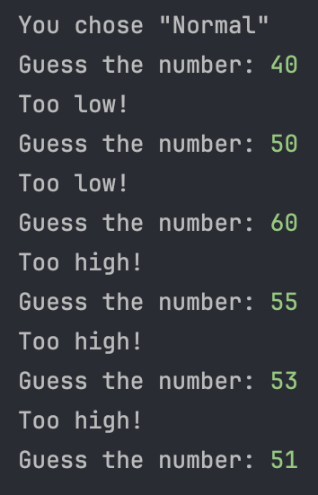

# "Guess-a-number" by Mario Lupo Ciaponi
A console version of "Guess a number".
Guess-a-number is a simple game that you have to guess the random generated number in a certain range(e.g. 1-100). I have
added difficulties were the range extends. Also, I have added a gamemode were you have limited tries which differ of the
difficulty that you chose. You win when you guess the random number. If your number is too high a message will
print that says "Too high!" and if it is too low, "Too low!".

[Source code](https://github.com/Mario-Lupo-Ciaponi/Guess-a-number/blob/main/guess_a_number.py)

## Purpose of the game
The purpose of this project is to practice Git and GitHub. I am currently learning programming so this is not much of 
a project, but I tried to implement some unique features. If you encounter any bugs in my code please let me know. 

